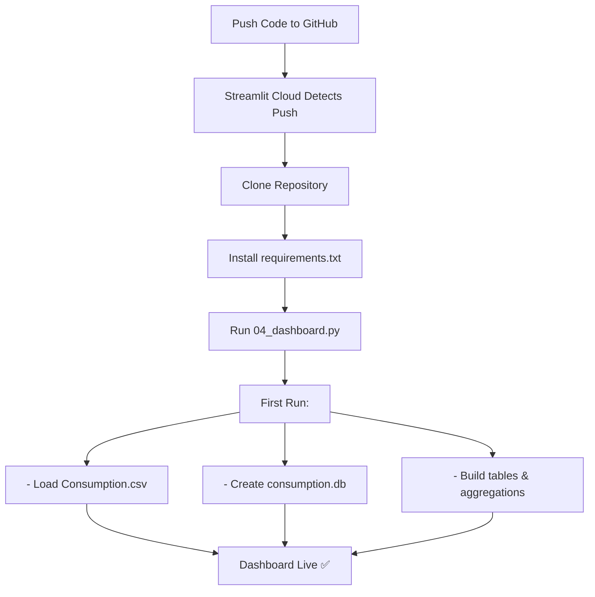

# 🚀 Deployment Guide — Streamlit Cloud

This guide explains how to deploy your **India Electricity Consumption Dashboard** to **Streamlit Cloud** and make it publicly accessible on the web.

---

## 📋 Prerequisites

Before deployment, ensure you have:

1. ✅ **GitHub Account** — https://github.com (free)
2. ✅ **Streamlit Cloud Account** — https://streamlit.io/cloud (free)
3. ✅ **Git installed** — https://git-scm.com
4. ✅ **Project pushed to GitHub** — Your repo must be on GitHub

---

## 🔧 Step 1: Prepare Your Repository

### 1a. Ensure all files are committed and pushed to GitHub
```bash
cd c:\Users\faizz\OneDrive\Desktop\tableau
git add .
git commit -m "Final project with all scripts and diagrams"
git push origin main
```

### 1b. Verify these files exist in your repo:
```
tableau/
├── requirements.txt          ✅ REQUIRED
├── Consumption.csv           ✅ REQUIRED
├── 01_database_setup.py      ✅ REQUIRED
├── 02_data_cleaning.py       ✅ REQUIRED
├── 03_visualizations.py      ✅ REQUIRED
├── 04_dashboard.py           ✅ REQUIRED (entry point)
├── .streamlit/
│   └── config.toml          ✅ REQUIRED (just created)
├── README.md                 ✅ REQUIRED
└── .gitignore               ✅ RECOMMENDED
```

---

## 🌐 Step 2: Deploy to Streamlit Cloud

### 2a. Go to Streamlit Cloud
1. Open https://streamlit.io/cloud
2. Click **"Get started"** or **"Sign in"**
3. Click **"Continue with GitHub"**
4. Authorize Streamlit to access your GitHub account

### 2b. Create a New App
1. After authorizing, you'll see the **"Create app"** button
2. Click **"Create app"**
3. You'll see a form with these fields:

```
Repository    → Select your Repository (tableau)
Branch        → main
Main file path → 04_dashboard.py
```

4. **Fill in the form:**
   - **Repository** → `yourGitHubUsername/tableau`
   - **Branch** → `main`
   - **Main file path** → `04_dashboard.py`

5. Click **"Deploy"**

### 2c. Wait for Deployment
- Status will show as **"Building"** for 2-3 minutes
- You'll see deployment logs in real-time
- Once complete, you'll get a public URL like:
  ```
  https://yourappname-xxxxx.streamlit.app
  ```

---

## ✅ Step 3: First Run & Data Initialization

### Important Note on First Deployment:
⚠️ On the **first deployment**, the database (`consumption.db`) doesn't exist yet. Streamlit Cloud will **automatically create it** on first run by:

1. Reading `Consumption.csv`
2. Running database setup in memory
3. Creating all tables and aggregations
4. Computing all charts

**First load may take 30-60 seconds** — this is normal.

### To Speed Up Subsequent Loads:
- The database caches in Streamlit Cloud's file system
- Subsequent loads will be **instant** (< 5 seconds)

---

## 🔗 Step 4: Share Your Dashboard

### Your public dashboard is now live at:
```
https://yourappname-xxxxx.streamlit.app
```

### Share it by:
1. ✅ Copy the URL from browser
2. ✅ Send to friends, colleagues, stakeholders
3. ✅ Post on social media / LinkedIn
4. ✅ Embed in websites (Streamlit provides embed code)

### Get a Custom URL (Optional):
- Go to https://streamlit.io/cloud
- Click your app
- Go to **Settings → General → URL**
- Request a custom domain (if available)

---

## 🛠️ Step 5: Troubleshooting Deployment

### Issue: "Module not found" error
**Solution:** Ensure `requirements.txt` has all dependencies:
```bash
pip freeze > requirements.txt
```

### Issue: CSV file not found
**Solution:** Verify `Consumption.csv` is committed to GitHub:
```bash
git add Consumption.csv
git commit -m "Add consumption data"
git push
```

### Issue: Dashboard takes too long
**Solution:** 
- First run initializes database — this is expected
- Subsequent runs use cached database
- If still slow, reduce data size or optimize queries

### Issue: Can't deploy to Streamlit Cloud
**Solution:**
1. Ensure `.gitignore` does NOT exclude `Consumption.csv`
2. Rerun `git push` to update GitHub
3. Restart deployment from Streamlit Cloud

---

## 📊 What Happens During Deployment



---

## 🔐 Security & Privacy

### Public vs Private Deployment

**By Default:** Your app is **PUBLIC**
- Anyone with the URL can access it
- No login required
- Data is readable as it's displayed on the dashboard

### If You Want Private Access:
1. Go to **Streamlit Cloud Settings**
2. Set **"Sharing"** to **"Private"**
3. Only people with Streamlit accounts you approve can access

---

## 📈 Monitoring & Updates

### View Deployment Status
1. Go to https://streamlit.io/cloud
2. Click your app name
3. See deployment logs and status

### Push Updates
Any changes pushed to GitHub automatically redeploy:

```bash
git add .
git commit -m "Update dashboard with new features"
git push origin main
```

Streamlit Cloud detects the push and redeploys automatically (2-3 min).

---

## 🎯 Performance Tips

### For Faster Loads:
1. ✅ Ensure `.gitignore` excludes `.venv/` but NOT `Consumption.csv`
2. ✅ Use `@st.cache_data` decorator (already in your code)
3. ✅ Cache database queries using SQLAlchemy
4. ✅ Avoid large filter operations on first load

### Current Optimizations Already in Your Code:
- ✅ `@st.cache_resource` for database engine
- ✅ `@st.cache_data` for data loading
- ✅ Pre-aggregated views in database
- ✅ Efficient Plotly charts

---

## 📱 Mobile Responsiveness

Your Streamlit dashboard automatically adapts to mobile/tablet screens:

- 📱 **Mobile** — Single column layout, stacked charts
- 💻 **Tablet** — 2-column layout
- 🖥️ **Desktop** — Full multi-column layout

No additional changes needed!

---

## 🎨 Customization (After Deployment)

### Edit `.streamlit/config.toml` to customize:

```toml
[theme]
primaryColor = "#2c3e50"      # Change brand color
backgroundColor = "#ecf0f1"   # Page background
textColor = "#2c3e50"         # Text color
font = "sans serif"           # Font family

[client]
showErrorDetails = true       # Show debugging info
toolbarMode = "viewer"        # Hide dev tools
```

Then push to GitHub:
```bash
git add .streamlit/config.toml
git commit -m "Update theme colors"
git push
```

---

## 📊 Alternative Deployment Options

If Streamlit Cloud doesn't work for you, alternatives:

| Platform | Cost | Setup Time | Best For |
|----------|------|-----------|----------|
| **Streamlit Cloud** | Free | 5 min | Quick deployment |
| **Heroku** | Free tier ended | 15 min | Full control |
| **PythonAnywhere** | Free with limits | 10 min | Long-term hosting |
| **AWS/GCP** | Pay-as-you-go | 30 min | Scalability |
| **GitHub Pages** | Free | 10 min | Static docs only |

---

## ✅ Final Checklist

Before sharing your deployed dashboard:

- [ ] Code committed and pushed to GitHub
- [ ] `04_dashboard.py` is entry point
- [ ] `requirements.txt` has all packages
- [ ] `Consumption.csv` is in repository
- [ ] Streamlit Cloud app created and deployed
- [ ] Dashboard loads successfully at public URL
- [ ] All filters and charts work
- [ ] CSV download button functions
- [ ] Share URL with stakeholders

---

## 🎉 Success!

Your dashboard is now **live on the web** and accessible to anyone with the link!

**Share it with:**
- 👥 Team members
- 📧 Stakeholders
- 🌐 Public internet
- 📱 Mobile devices

---

## 📧 Support

If you encounter issues:

1. Check **Streamlit Cloud deployment logs**
2. Review **requirements.txt** for missing packages
3. Verify **Consumption.csv** is in repo
4. Visit **Streamlit Docs**: https://docs.streamlit.io
5. Visit **GitHub Issues** in your repo

---

<div align="center">

**Your dashboard is now globally accessible! 🌍⚡**

</div>
