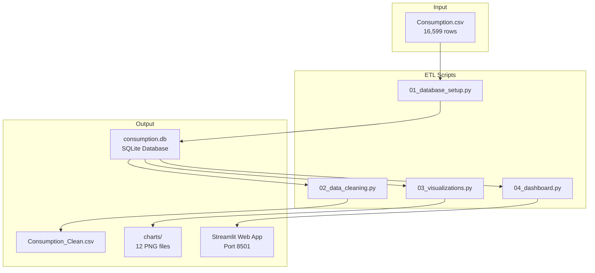
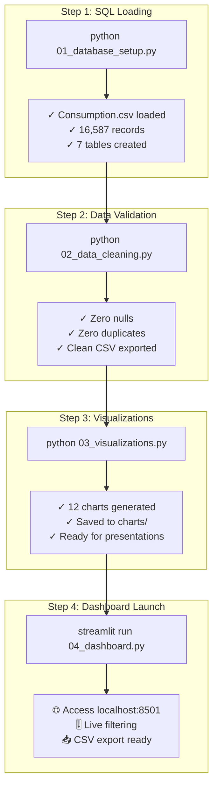
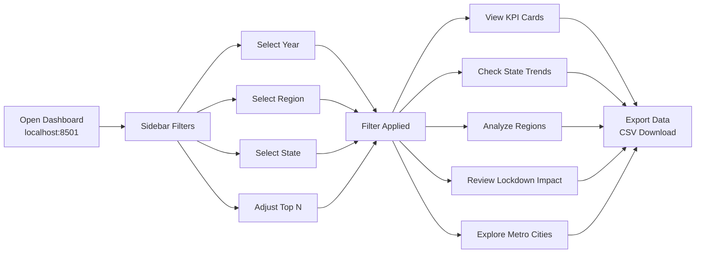
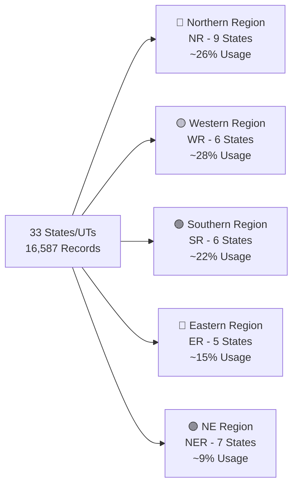
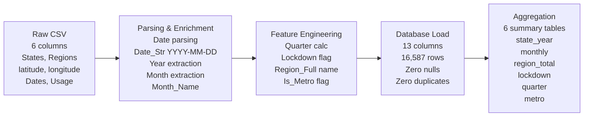
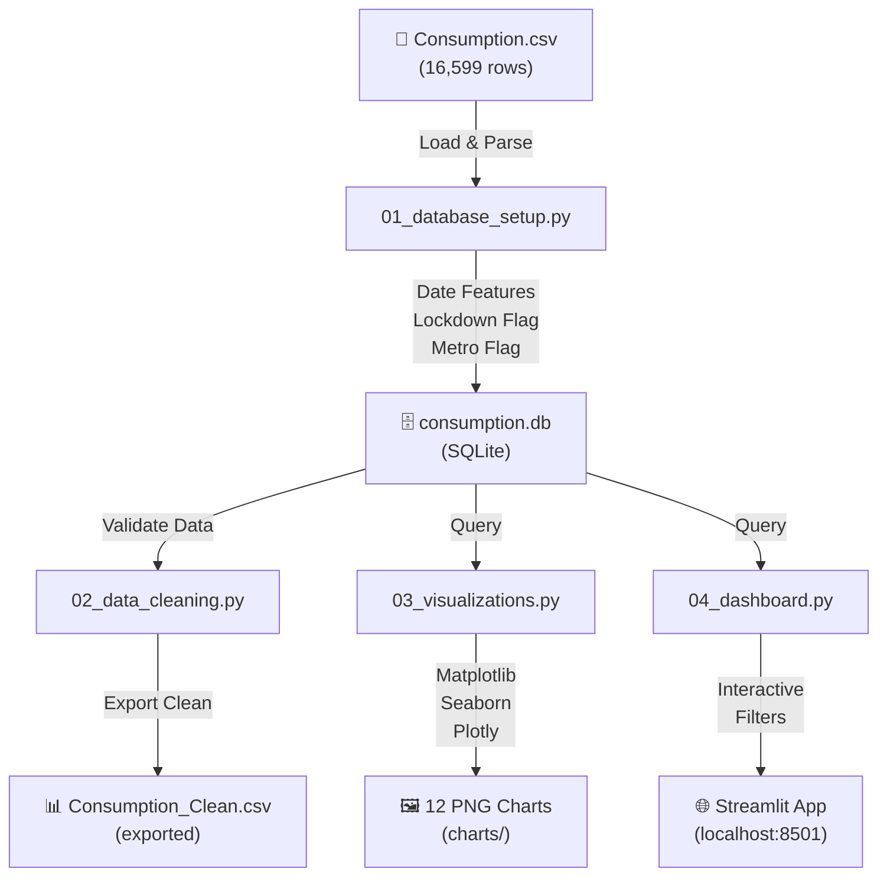
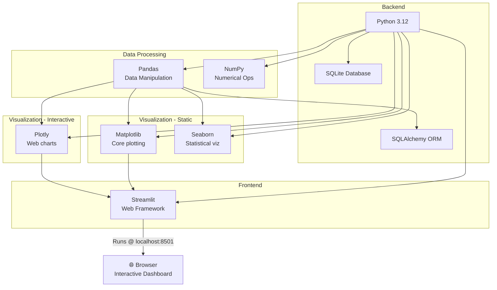

# ⚡ India Electricity Consumption Analytics Dashboard

A **comprehensive data analytics and visualization project** analyzing state-wise electricity consumption across India for 2019–2020, with a focus on the impact of the COVID-19 lockdown (March 25, 2020).

---

## 📋 Project Overview

This project processes a dataset of daily electricity consumption records across all Indian states and union territories, performs data cleaning and transformation, and provides:

- ✅ **Structured SQLite Database** with aggregated views for fast querying
- ✅ **12 Production-Quality Visualizations** (static PNG charts)
- ✅ **Interactive Streamlit Dashboard** with real-time filtering and drill-downs
- ✅ **Complete Data Integrity Report** with null/duplicate validation
- ✅ **Clean exported CSV** for external use

### Key Objectives
1. **Acquire & Clean** raw electricity consumption data
2. **Transform & Enrich** data with time-based features (month, quarter, lockdown flag)
3. **Analyze Trends** across regions, states, metro cities, and before/after lockdown
4. **Visualize** patterns for stakeholder communication
5. **Enable Interactive Exploration** via Streamlit dashboard

---

## 📊 Dataset

**Source:** `Consumption.csv`  
**Format:** CSV (16,599 rows, 6 columns)  
**Time Period:** January 2, 2019 — December 5, 2020  
**Geographic Coverage:** All 33 Indian states & union territories

### Original Columns
- `States` — State/Union Territory name
- `Regions` — Region code (NR, WR, SR, ER, NER)
- `latitude` — Geographic latitude
- `longitude` — Geographic longitude
- `Dates` — Date of measurement (DD/MM/YYYY format)
- `Usage` — Electricity consumption (in MU — Million Units)

### Derived Columns (added during ETL)
- `Year` — Extracted year
- `Month` — Extracted month (1–12)
- `Month_Name` — Month name (January, February, etc.)
- `Quarter` — Quarter (Q1–Q4)
- `Date_Str` — Standardized date (YYYY-MM-DD)
- `Lockdown` — Flag: "Before Lockdown" or "After Lockdown" (cutoff: 2020-03-25)
- `Region_Full` — Full region name (Northern Region, Western Region, etc.)
- `Is_Metro` — Binary flag for metro states (Delhi, Maharashtra, Tamil Nadu, etc.)

---

## 📂 Project Structure



---

## � Quick Reference Guide



```bash
cd tableau
pip install -r requirements.txt
```

**Packages installed:**
- `pandas` — Data manipulation
- `matplotlib` — Static plotting
- `seaborn` — Statistical visualization
- `plotly` — Interactive charts
- `streamlit` — Web dashboard framework
- `sqlalchemy` — SQL toolkit & ORM
- `openpyxl` — Excel support

### 2. Run the ETL Pipeline (3 steps)

#### Step 1: Database Setup & Load
```bash
python 01_database_setup.py
```
**Output:**
- Creates `consumption.db` (SQLite)
- Loads 16,587 records
- Creates 6 aggregate tables
- Shows data summary

#### Step 2: Data Cleaning & Validation
```bash
python 02_data_cleaning.py
```
**Output:**
- Validates null values ✅ (none found)
- Checks for duplicates ✅ (none found)
- Generates statistics
- Exports `Consumption_Clean.csv`
- Prints integrity report

#### Step 3: Generate Visualizations
```bash
python 03_visualizations.py
```
**Output:**
- Saves 12 PNG charts to `charts/` folder
- Uses matplotlib, seaborn, plotly
- High DPI (150) for presentation quality
- ~2-3 minutes to complete

### 3. Launch Interactive Dashboard

```bash
streamlit run 04_dashboard.py
```

**Output:**
```
  You can now view your Streamlit app in your browser.

  Local URL: http://localhost:8501
  Network URL: http://192.168.x.x:8501
```

Open **http://localhost:8501** in your browser.

---

## � Visualization Types & Coverage

```mermaid
graph TB
    A["12 Visualizations"]
    
    subgraph "Categorical Comparisons"
        B["01-02: State Consumption<br/>Horizontal Bars"]
        C["04: Region Analysis<br/>Grouped Bars"]
        D["05: Top/Bottom N<br/>Ranking Bars"]
        E["11: Metro Cities<br/>City Comparison"]
    end
    
    subgraph "Trends Over Time"
        F["06: Month-wise<br/>Line Chart"]
        G["10: Quarterly<br/>Line Chart"]
    end
    
    subgraph "Composition & Distribution"
        H["07: Region Share<br/>Pie Chart"]
        I["03: Stacked Total<br/>Stacked Bar"]
        J["12: Distribution<br/>Box Plot"]
    end
    
    subgraph "Multivariate Analysis"
        K["08: Lockdown Impact<br/>Grouped Bar"]
        L["09: Region×State<br/>Heatmap"]
    end
    
    A --> B
    A --> C
    A --> D
    A --> E
    A --> F
    A --> G
    A --> H
    A --> I
    A --> J
    A --> K
    A --> L
```



---

## 👤 User Journey — Interactive Dashboard



---

## 📊 Key Insights

### Data Quality
✅ **16,587 records** across 33 states/UTs  
✅ **No missing values** in any column  
✅ **No duplicates** found  
✅ **Valid date range** — Jan 2, 2019 to Dec 5, 2020  
✅ **Positive usage values** — All ≥ 0.3 MU  

### Regional Distribution


### Top 5 Consumers (2019–2020 Combined)
1. **Uttar Pradesh** — Largest consumer
2. **Maharashtra** — Major industrial hub
3. **Tamil Nadu** — High manufacturing
4. **Rajasthan** — Large agricultural state
5. **Gujarat** — Industrial powerhouse

### Lockdown Impact
- **Larger decrease expected** after March 25, 2020
- **Industrial & commercial** consumption likely reduced
- **Residential usage** may have increased
- **Regional variation** in lockdown effects

---

## 🛢️ Database Schema & Transformation

### Data Transformation Steps



### Main Table: `consumption`
```sql
Column           | Type      | Description
-----------------|-----------|---------------------------
States           | TEXT      | State/UT name
Regions          | TEXT      | Region code (NR, WR, etc.)
latitude         | REAL      | Geographic coordinate
longitude        | REAL      | Geographic coordinate
Dates            | TEXT      | Date (standardized)
Usage            | REAL      | Consumption (MU)
Year             | INTEGER   | Extracted year
Month            | INTEGER   | Month (1–12)
Month_Name       | TEXT      | Month name
Quarter          | INTEGER   | Quarter (1–4)
Date_Str         | TEXT      | Date (YYYY-MM-DD)
Lockdown         | TEXT      | Before/After flag
Region_Full      | TEXT      | Full region name
Is_Metro         | INTEGER   | Metro state flag (0/1)
```

### Aggregate Tables
- `state_year` — Total usage per state per year
- `monthly` — Total usage per month per year
- `region_total` — Total usage per region per year
- `lockdown` — Regional totals before/after lockdown
- `quarter` — Total usage per quarter
- `metro` — Metro state usage by year

---

## 🔄 Data Flow



---

## 📈 Analysis Use Cases

1. **Policy Makers** — Understand regional consumption patterns for resource planning
2. **Energy Companies** — Forecast demand, plan infrastructure
3. **Researchers** — Study COVID-19 impact on electricity consumption
4. **Business Analysts** — Identify high-opportunity markets (metro vs tier-2)
5. **Students** — Learn ETL, visualization, and dashboard development

---

## 🔧 Troubleshooting

### Issue: ModuleNotFoundError
**Solution:** Reinstall packages
```bash
pip install -r requirements.txt
```

### Issue: Streamlit won't start
**Solution:** Check if port 8501 is in use, or specify a different port
```bash
streamlit run 04_dashboard.py --server.port 8502
```

### Issue: Database locked
**Solution:** Delete `consumption.db` and rerun `01_database_setup.py`

### Issue: Charts not generated
**Solution:** Ensure `charts/` directory exists; if missing, create it manually
```bash
mkdir charts
```

---

## 📝 File Descriptions

### 01_database_setup.py
- Reads `Consumption.csv`
- Parses dates in DD/MM/YYYY format
- Adds derived columns (Year, Month, Quarter, Lockdown flag, etc.)
- Creates SQLite database with 7 tables (1 main + 6 aggregates)
- Validates data and prints summary

### 02_data_cleaning.py
- Reads from `consumption.db`
- Generates comprehensive data quality report
- Checks for nulls, duplicates, outliers
- Shows statistics and unique value counts
- Exports cleaned data to `Consumption_Clean.csv`

### 03_visualizations.py
- Generates 12 professional charts
- Uses matplotlib, seaborn, plotly backends
- Saves PNG files at 150 DPI
- Includes data labels and proper formatting
- Fully automated — no manual intervention needed

### 04_dashboard.py
- Streamlit-based interactive web application
- Multi-select filters for Year, Region, State
- Dynamic KPI cards (total, average, YoY change)
- 10+ interactive charts (Plotly)
- Raw data table with export button
- Responsive design for desktop & mobile

---

---

## 🛠️ Technology Stack



### Technology Details

| Technology | Purpose |
|-----------|---------|
| **Python 3.12** | Core language |
| **Pandas** | Data manipulation & cleaning |
| **SQLAlchemy** | Database ORM |
| **SQLite** | Local database |
| **Matplotlib & Seaborn** | Static visualizations |
| **Plotly** | Interactive charts |
| **Streamlit** | Web dashboard framework |

---

## 📅 ETL Pipeline Timeline

```mermaid
timeline
    title Data Analytics Pipeline Execution
    section Setup
        Install Dependencies : done, 0, 2m
        Configure Environment : done, 2m, 1m
    section Processing
        01 Database Setup : done, 3m, 1m
        02 Data Cleaning : done, 4m, 1m
        03 Visualizations : done, 5m, 3m
    section Delivery
        04 Dashboard Ready : active, 8m, 30s
        Available @ localhost:8501 : crit, 8m, 30m
```

---

## 📄 License & Attribution

- **Dataset:** Electricity consumption data — Indian states (2019–2020)
- **Project:** Data Analytics & Visualization Pipeline
- **Regions Referenced:** Northern (NR), Western (WR), Southern (SR), Eastern (ER), North-Eastern (NER)

---

## 💡 Future Enhancements

- [ ] Forecast 2021+ consumption using ARIMA/Prophet
- [ ] Add prediction confidence intervals
- [ ] Integration with external weather data
- [ ] Route-based energy distribution modeling
- [ ] Real-time data ingestion from utility APIs
- [ ] Machine learning anomaly detection

---

## 📧 Support & Questions

For issues or improvements, please refer to:
- Python error messages — Check terminal output
- Dashboard errors — Inspect browser console (F12)
- Database issues — Verify `consumption.db` exists and is readable

---

<div align="center">

**Built with ❤️ for India's Energy Analytics**

⚡ [Dashboard](http://localhost:8501) • 📊 [Charts](./charts) • 📖 [Data](./Consumption_Clean.csv)

</div>
